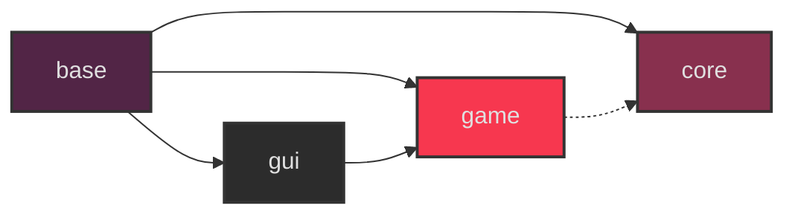

# I don't know what this is (yet)

## Deps
```terminal
sudo dnf install git clang clang-devel SDL3 SDL3-devel glew glew-devel -y
dnf debuginfo-install SDL3 #optional
git lfs install
```
## Cloning
This repo uses git LFS for assets and a submodule for stb libraries, you can:
```bash
git clone --recursive https://github.com/eliasvas/game0
```
## Building
### Linux
```bash
./build.sh
```
### Linux (inside vim)
```
# add these to your .vimrc
nnoremap <F7> :!./build.sh<CR>
nnoremap <F6> :!gf2<CR>
nnoremap <F5> :!bash -c 'source ./build.sh && ./build/game0'<CR>

```
### Web (From Linux)
first install and activate [emscripten](https://emscripten.org/docs/getting_started/downloads.html)
```bash
./build_web.sh
cd build
python -m http.server
->localhost:8000 in your browser
```

## Module Architecture

